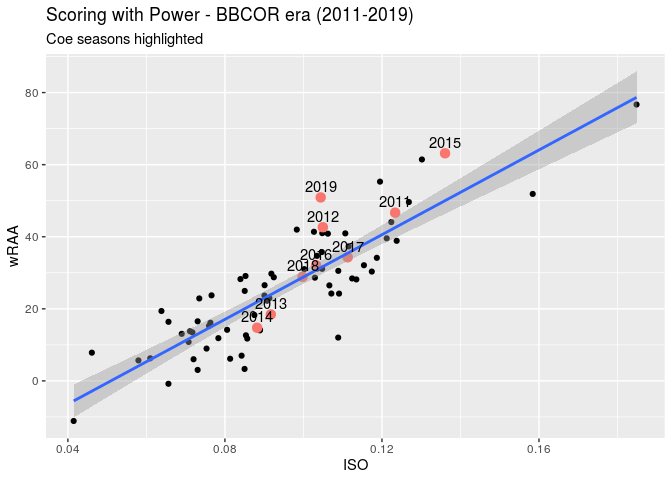

The 2019 season for Coe College Baseball ended with a program record 37 wins and an appearence in the NCAA Super Regional. Dominating both sides of the ball, Coe had 9 total all-conference players, the ARC pitcher of the year, and coach of the year. Aside from the considerable experienced talent that was on the field, the purpose of this paper is to analyize what exactly went right. Even in a year in which we won the conference by a comfortable seven games, there a still areas we can improve on moving forward. Our goal will be to replicate 30+ win seasons even when we lose large contribtors due to graduation.  

A noticeable trait off-the-bat was our strikeout rate improvement. A 3.5% improvement helped to post the best K:BB ratio since 2013. We struckout considerably less than the rest of the conference in 2019, with Wartburg's 15.2% being the second lowest. There were some extreme struggles in the ARC, as Dubuque posted the 7th worst K% of all-time (since 2001) - 19.14% and Nebraska Wesleyan had a conference all-time worst 22%. However, the worst K:BB ratio was held by the conference tournament champion, Buena Vista (2.83). The only ratio better than Coe was Dubuque because of their impressive 13.13% walk rate, compensating for their enormous (19.6%) strikeout rate       
<table class="table table-striped table-hover" style="font-size: 12px; margin-left: auto; margin-right: auto;">
 <thead>
  <tr>
   <th style="text-align:center;"> Year </th>
   <th style="text-align:center;"> Team </th>
   <th style="text-align:center;"> K% </th>
   <th style="text-align:center;"> BB% </th>
   <th style="text-align:center;"> K:BB </th>
  </tr>
 </thead>
<tbody>
  <tr>
   <td style="text-align:center;"> 2013 </td>
   <td style="text-align:center;"> COE </td>
   <td style="text-align:center;"> 0.12 </td>
   <td style="text-align:center;"> 0.08 </td>
   <td style="text-align:center;"> 1.45 </td>
  </tr>
  <tr>
   <td style="text-align:center;"> 2014 </td>
   <td style="text-align:center;"> COE </td>
   <td style="text-align:center;"> 0.15 </td>
   <td style="text-align:center;"> 0.08 </td>
   <td style="text-align:center;"> 1.82 </td>
  </tr>
  <tr>
   <td style="text-align:center;"> 2015 </td>
   <td style="text-align:center;"> COE </td>
   <td style="text-align:center;"> 0.12 </td>
   <td style="text-align:center;"> 0.07 </td>
   <td style="text-align:center;"> 1.68 </td>
  </tr>
  <tr>
   <td style="text-align:center;"> 2016 </td>
   <td style="text-align:center;"> COE </td>
   <td style="text-align:center;"> 0.14 </td>
   <td style="text-align:center;"> 0.07 </td>
   <td style="text-align:center;"> 1.94 </td>
  </tr>
  <tr>
   <td style="text-align:center;"> 2017 </td>
   <td style="text-align:center;"> COE </td>
   <td style="text-align:center;"> 0.17 </td>
   <td style="text-align:center;"> 0.08 </td>
   <td style="text-align:center;"> 2.10 </td>
  </tr>
  <tr>
   <td style="text-align:center;"> 2018 </td>
   <td style="text-align:center;"> COE </td>
   <td style="text-align:center;"> 0.15 </td>
   <td style="text-align:center;"> 0.08 </td>
   <td style="text-align:center;"> 2.05 </td>
  </tr>
  <tr>
   <td style="text-align:center;"> 2019 </td>
   <td style="text-align:center;"> COE </td>
   <td style="text-align:center;"> 0.12 </td>
   <td style="text-align:center;"> 0.08 </td>
   <td style="text-align:center;"> 1.51 </td>
  </tr>
</tbody>
</table>
The most important aspect for improvement in 2020 is drawing more walks, as our 7.95\% walk rate ranked 7th in the conference. We can see that our walk rate has remained relatively steady over the course of the BBCOR era. The overall offensive difference in 2019 was not only a significant contact rate increase, but also a 33-point increase in BABIP (batting average on balls in play) from .349 to .381. The average BABIP in the BBCOR era is .341.

We can attribute this to three different factors. First, we can look at the league defense and on the surface, it does not seem like this was the biggest contributor. We do not have the capability to construct advanced defensive metrics that might be able to tell us more, but the conference was slightly better defensively in 2019 compared to 2018. There was an average fielding percentage of .954 and 65.3 errors in 2018 and an average of .957 and 60.8 errors in 2019.
 
The next aspect to consider is a better talent level and better quality of contact. With the talented, experienced, and deep lineup that we had, our hard hit percentage was undoubtedly higher. From a philosophical standpoint, focusing on the optimal launch parameters for the D-III game in training looks to have had a beneficial effect. Lower launch angles that put more pressure on the defense to make plays is more sustainable throughout a season at this level, and especially this level in the BBCOR era.

Lastly, the aspect of luck is likely to have contributed to the spike in BABIP. A 45-game season can prevent some of the normal BABIP irregularities from evening out. To protect against this inevitable regression, generating more walks while not sacrificing with swings and misses or looking K's can help close the gap. The only 2 teams with a higher BABIP in the BBCOR era than Coe in 2019 were Dubuque in 2018 and Buena Vista in 2016, both at .386. In 2019, Dubuque cratered to .326 and in 2017, Buena Vista normalized to near the BBCOR mean of .346.

The lack of walks from our top hitters can be seen in their wOBAs, or weighted on-base average. This stat combines all aspects of hitting and weighs them in proportion to their actual run value. We had no players in the top-10 of wOBA for conference starters. Burns and Frazier tied for 12th at .249. While there was not the presence at the top, it was made up with the consistency of the team. Coe led the conference with a .234 wOBA and Evans was the only starter below the league starter average (.216) at .201. This includes position players that started at least 20 games in 2019. Simpson's Truman Schmitt had the highest wOBA at .310 and was almost 20 points ahead of the next closest hitter, Luke Plunkett of Luther. Coe's top-6 hitters were between .243 (Arp) and .249 (Burns & Frazier). Throughout the other 8 conference teams, there were 25 starters with sub-.200 wOBAs. Coe had none.

In the BBCOR era (2011-Present), the 2019 Kohawks scored the 5th most runs in a season (314), only behind 2016 Luther, 2016 Buena Vista, 2015 Coe and 2014 Buena Vista. Individually, we had 3 hitters in the top-10 of wRAA (weighted runs above average). This measures the number of runs a player contributes to his team compared to the average player. This is a counting statistic, so players accrue more (or less) the more they play. This can be thought of as a player's offensive WAR (wins above replacement). A player with a wRAA of 0 would therefore be a replacement level hitter. Table 2 shows the conference's top players in terms of wRAA. Each team is represented in the top-10 with the exception of Loras

<table class="table table-striped table-hover" style="font-size: 12px; margin-left: auto; margin-right: auto;">
 <thead>
  <tr>
   <th style="text-align:left;"> Player </th>
   <th style="text-align:left;"> Team </th>
   <th style="text-align:left;"> AVG </th>
   <th style="text-align:right;"> HR </th>
   <th style="text-align:right;"> wOBA </th>
   <th style="text-align:right;"> wRAA </th>
   <th style="text-align:right;"> wRC </th>
  </tr>
 </thead>
<tbody>
  <tr>
   <td style="text-align:left;"> Bryce Rheault </td>
   <td style="text-align:left;"> BVU </td>
   <td style="text-align:left;"> 0.399 </td>
   <td style="text-align:right;"> 3 </td>
   <td style="text-align:right;"> 0.277 </td>
   <td style="text-align:right;"> 11.646 </td>
   <td style="text-align:right;"> 47.890 </td>
  </tr>
  <tr>
   <td style="text-align:left;"> Truman Schmitt </td>
   <td style="text-align:left;"> SIM </td>
   <td style="text-align:left;"> 0.39 </td>
   <td style="text-align:right;"> 5 </td>
   <td style="text-align:right;"> 0.311 </td>
   <td style="text-align:right;"> 11.422 </td>
   <td style="text-align:right;"> 37.720 </td>
  </tr>
  <tr>
   <td style="text-align:left;"> Garrett Saunders </td>
   <td style="text-align:left;"> CEN </td>
   <td style="text-align:left;"> 0.361 </td>
   <td style="text-align:right;"> 3 </td>
   <td style="text-align:right;"> 0.276 </td>
   <td style="text-align:right;"> 9.387 </td>
   <td style="text-align:right;"> 38.719 </td>
  </tr>
  <tr>
   <td style="text-align:left;"> Luke Plunkett    </td>
   <td style="text-align:left;"> LUT </td>
   <td style="text-align:left;"> 0.352 </td>
   <td style="text-align:right;"> 4 </td>
   <td style="text-align:right;"> 0.282 </td>
   <td style="text-align:right;"> 8.638 </td>
   <td style="text-align:right;"> 34.093 </td>
  </tr>
  <tr>
   <td style="text-align:left;"> Derek Kolbush </td>
   <td style="text-align:left;"> NWU </td>
   <td style="text-align:left;"> 0.354 </td>
   <td style="text-align:right;"> 4 </td>
   <td style="text-align:right;"> 0.272 </td>
   <td style="text-align:right;"> 7.929 </td>
   <td style="text-align:right;"> 34.058 </td>
  </tr>
  <tr>
   <td style="text-align:left;"> Jordan Kaplan   </td>
   <td style="text-align:left;"> COE </td>
   <td style="text-align:left;"> 0.333 </td>
   <td style="text-align:right;"> 5 </td>
   <td style="text-align:right;"> 0.249 </td>
   <td style="text-align:right;"> 7.614 </td>
   <td style="text-align:right;"> 41.161 </td>
  </tr>
  <tr>
   <td style="text-align:left;"> Kellen Mitchell    </td>
   <td style="text-align:left;"> DBQ </td>
   <td style="text-align:left;"> 0.347 </td>
   <td style="text-align:right;"> 2 </td>
   <td style="text-align:right;"> 0.266 </td>
   <td style="text-align:right;"> 7.583 </td>
   <td style="text-align:right;"> 34.049 </td>
  </tr>
  <tr>
   <td style="text-align:left;"> Kevin DeLaney   </td>
   <td style="text-align:left;"> COE </td>
   <td style="text-align:left;"> 0.344 </td>
   <td style="text-align:right;"> 2 </td>
   <td style="text-align:right;"> 0.244 </td>
   <td style="text-align:right;"> 7.572 </td>
   <td style="text-align:right;"> 43.311 </td>
  </tr>
  <tr>
   <td style="text-align:left;"> Tyler Hovick   </td>
   <td style="text-align:left;"> WAR </td>
   <td style="text-align:left;"> 0.333 </td>
   <td style="text-align:right;"> 5 </td>
   <td style="text-align:right;"> 0.270 </td>
   <td style="text-align:right;"> 7.027 </td>
   <td style="text-align:right;"> 30.628 </td>
  </tr>
  <tr>
   <td style="text-align:left;"> Jacob Burns   </td>
   <td style="text-align:left;"> COE </td>
   <td style="text-align:left;"> 0.366 </td>
   <td style="text-align:right;"> 2 </td>
   <td style="text-align:right;"> 0.249 </td>
   <td style="text-align:right;"> 6.997 </td>
   <td style="text-align:right;"> 37.678 </td>
  </tr>
</tbody>
</table>
Another statistic that showcases our successful offensive season is wRC (weighted runs created). Developed by Tom Tango, weighted runs created credits a player for their total offensive production over a season. This stat can be viewed as the ``raw number" version of wRAA. Coe had 4 players in the top-10 in 2019. For comparison, Coe had 4 regular players with a below average wRAA in 2018, and 5 regulars hitting below .250.

3 out of the remaining 4 regular starters starters (Arp, LeGrand and Berger) were in the top 30 - all with at least 30 wRC. Frazier (20) and Evans (17) combined for 37 wRC in 163 at-bats in center field, as they essentially split time. Henry had 18 wRC for the 75% of games he started at third.

An impressive aspect of our offensive success in 2019 was that it was not a result of a substantial increase in power output. The plot below shows that our .104 ISO (isolated power) predicts us to be average or even slightly below average in terms of weighted runs above average. We tended to manufacture runs with an abundance of singles and the occasional extra base-hit. Our 398 singles were the most in the BBCOR era. A good representation of this was the 15-2 victory over Luther on April 16th in which we had 20 hits, 18 singles, and 2 strikeouts.

<!-- -->

2019 was easily the best pitching performance from a Coe College pitching staff since 2001. A 2.74 ERA that ranked 3rd nationally was better than our next best year, 2015, by .79 runs. In a season in which the 2015 team almost mirrored the 2019 offensive output, the recent pitching was far superior. We also posted our best strikeout rate since 2001 (24.6%) and this was the third best in conference history -- only behind 2014 Buena Vista (28.9%) and 2012 Wartburg (25.2%). We averaged a 15.05% K-rate from 2011-2016, with growth to 19.14% in 2017 and 19.76% in 2018 before last season's monumental jump. When combined with the 3rd best walk rate in the conference, it was a recipe for success, evidenced by the 8th best ratio in the era. In 2018, we had our worst walk rate since 2006 (12.32%) and responded with more than a 3% improvement. Another improvement in 2020 should be an expectation given the experience we will have on the mound once again. While Dubuque was able to do a great job limiting walks throughout the 2019 season, it did not translate well enough to run prevention given their offensive output.

<table class="table table-striped table-hover" style="font-size: 12px; margin-left: auto; margin-right: auto;">
 <thead>
  <tr>
   <th style="text-align:right;"> Year </th>
   <th style="text-align:left;"> Team </th>
   <th style="text-align:right;"> ERA </th>
   <th style="text-align:right;"> K% </th>
   <th style="text-align:right;"> BB% </th>
   <th style="text-align:right;"> K:BB </th>
  </tr>
 </thead>
<tbody>
  <tr>
   <td style="text-align:right;"> 2018 </td>
   <td style="text-align:left;"> DBQ </td>
   <td style="text-align:right;"> 3.39 </td>
   <td style="text-align:right;"> 20.99 </td>
   <td style="text-align:right;"> 5.63 </td>
   <td style="text-align:right;"> 3.73 </td>
  </tr>
  <tr>
   <td style="text-align:right;"> 2019 </td>
   <td style="text-align:left;"> DBQ </td>
   <td style="text-align:right;"> 4.07 </td>
   <td style="text-align:right;"> 24.09 </td>
   <td style="text-align:right;"> 6.84 </td>
   <td style="text-align:right;"> 3.52 </td>
  </tr>
  <tr>
   <td style="text-align:right;"> 2017 </td>
   <td style="text-align:left;"> DBQ </td>
   <td style="text-align:right;"> 3.95 </td>
   <td style="text-align:right;"> 20.53 </td>
   <td style="text-align:right;"> 5.99 </td>
   <td style="text-align:right;"> 3.43 </td>
  </tr>
  <tr>
   <td style="text-align:right;"> 2013 </td>
   <td style="text-align:left;"> WAR </td>
   <td style="text-align:right;"> 3.70 </td>
   <td style="text-align:right;"> 21.52 </td>
   <td style="text-align:right;"> 6.96 </td>
   <td style="text-align:right;"> 3.09 </td>
  </tr>
  <tr>
   <td style="text-align:right;"> 2017 </td>
   <td style="text-align:left;"> WAR </td>
   <td style="text-align:right;"> 3.12 </td>
   <td style="text-align:right;"> 23.25 </td>
   <td style="text-align:right;"> 7.86 </td>
   <td style="text-align:right;"> 2.96 </td>
  </tr>
  <tr>
   <td style="text-align:right;"> 2016 </td>
   <td style="text-align:left;"> WAR </td>
   <td style="text-align:right;"> 3.53 </td>
   <td style="text-align:right;"> 19.21 </td>
   <td style="text-align:right;"> 6.54 </td>
   <td style="text-align:right;"> 2.94 </td>
  </tr>
  <tr>
   <td style="text-align:right;"> 2014 </td>
   <td style="text-align:left;"> BVU </td>
   <td style="text-align:right;"> 2.64 </td>
   <td style="text-align:right;"> 28.87 </td>
   <td style="text-align:right;"> 10.62 </td>
   <td style="text-align:right;"> 2.72 </td>
  </tr>
  <tr>
   <td style="text-align:right;"> 2019 </td>
   <td style="text-align:left;"> COE </td>
   <td style="text-align:right;"> 2.74 </td>
   <td style="text-align:right;"> 24.55 </td>
   <td style="text-align:right;"> 9.22 </td>
   <td style="text-align:right;"> 2.66 </td>
  </tr>
</tbody>
</table>

Coe had by far the best opponents batting average in the ARC at .224 that was the 2nd best since 2001, only trailing Buena Vista in 2014 by one point. The 2019 pitching staff was one of only 8 to post a sub-.250 batting average against over a season in conference history. Where we didn't have the K:BB that ratio that Dubuque did, we made up with generating consistent soft contact. Buena Vista was second in BAA at .251.

An issue in 2017 and 2018 was hit-by-pitches from our pitchers, ranking second-worst in the conference each season, with 58 and 59 respectively. In 2019, that total dropped to 37 which was third-best in the ARC. Buena Vista had a conference record 73 last season.

The individual stats from our pitching staff make understanding our success a lot easier. According to FIP (fielding independent pitching), measuring what a player’s ERA would look like over a given period of time if the pitcher were to have experienced league average results on balls in play and league average timing, Coe had 5 of the conference's top-10 qualified pitchers and 6 of the top-20. Table 5 ranks the pitchers FIPs that pitched at least 15 innings in 2019. Out of those 6, FIP tells us that conference pitcher of the year, Zach Kammin, was the worst of the group.


```
## 
## Call:
## lm(formula = ra ~ hr + bb + so, data = TpitchingIIAC)
## 
## Residuals:
##     Min      1Q  Median      3Q     Max 
## -73.793 -21.320  -5.531  20.282  93.134 
## 
## Coefficients:
##              Estimate Std. Error t value Pr(>|t|)    
## (Intercept) 133.94665   17.45938   7.672 1.72e-12 ***
## hr            2.51239    0.32947   7.626 2.23e-12 ***
## bb            0.69739    0.10488   6.649 4.69e-10 ***
## so           -0.17289    0.05195  -3.328  0.00109 ** 
## ---
## Signif. codes:  0 '***' 0.001 '**' 0.01 '*' 0.05 '.' 0.1 ' ' 1
## 
## Residual standard error: 31.09 on 156 degrees of freedom
## Multiple R-squared:  0.4912,	Adjusted R-squared:  0.4814 
## F-statistic: 50.19 on 3 and 156 DF,  p-value: < 2.2e-16
```

```
## 
## Call:
## lm(formula = ra ~ hr + bb + so + X1b + X2b + X3b + hbp, data = TpitchingIIAC)
## 
## Residuals:
##     Min      1Q  Median      3Q     Max 
## -41.185 -12.297  -0.278  10.716  50.602 
## 
## Coefficients:
##              Estimate Std. Error t value Pr(>|t|)    
## (Intercept) -37.79494   14.73458  -2.565   0.0113 *  
## hr            2.14334    0.19915  10.762  < 2e-16 ***
## bb            0.43199    0.06420   6.729 3.27e-10 ***
## so           -0.21091    0.03037  -6.944 1.04e-10 ***
## X1b           0.46024    0.04683   9.829  < 2e-16 ***
## X2b           0.97233    0.13008   7.475 5.69e-12 ***
## X3b           1.94288    0.35357   5.495 1.61e-07 ***
## hbp           0.35631    0.15032   2.370   0.0190 *  
## ---
## Signif. codes:  0 '***' 0.001 '**' 0.01 '*' 0.05 '.' 0.1 ' ' 1
## 
## Residual standard error: 17.66 on 152 degrees of freedom
## Multiple R-squared:  0.8401,	Adjusted R-squared:  0.8327 
## F-statistic: 114.1 on 7 and 152 DF,  p-value: < 2.2e-16
```

<table class="table table-striped table-hover" style="font-size: 12px; margin-left: auto; margin-right: auto;">
 <thead>
  <tr>
   <th style="text-align:left;"> Player </th>
   <th style="text-align:left;"> Team </th>
   <th style="text-align:right;"> IP </th>
   <th style="text-align:right;"> SO </th>
   <th style="text-align:right;"> BB </th>
   <th style="text-align:right;"> ERA </th>
   <th style="text-align:right;"> FIP </th>
  </tr>
 </thead>
<tbody>
  <tr>
   <td style="text-align:left;"> Chase Kueter </td>
   <td style="text-align:left;"> DBQ </td>
   <td style="text-align:right;"> 94.2 </td>
   <td style="text-align:right;"> 116 </td>
   <td style="text-align:right;"> 16 </td>
   <td style="text-align:right;"> 2.95 </td>
   <td style="text-align:right;"> 0.02 </td>
  </tr>
  <tr>
   <td style="text-align:left;"> Colin Coffey </td>
   <td style="text-align:left;"> LUT </td>
   <td style="text-align:right;"> 78.1 </td>
   <td style="text-align:right;"> 57 </td>
   <td style="text-align:right;"> 9 </td>
   <td style="text-align:right;"> 2.53 </td>
   <td style="text-align:right;"> 0.07 </td>
  </tr>
  <tr>
   <td style="text-align:left;"> Riley LeGrand </td>
   <td style="text-align:left;"> COE </td>
   <td style="text-align:right;"> 22.0 </td>
   <td style="text-align:right;"> 21 </td>
   <td style="text-align:right;"> 5 </td>
   <td style="text-align:right;"> 4.50 </td>
   <td style="text-align:right;"> 0.14 </td>
  </tr>
  <tr>
   <td style="text-align:left;"> TJ Deardorff </td>
   <td style="text-align:left;"> COE </td>
   <td style="text-align:right;"> 43.0 </td>
   <td style="text-align:right;"> 38 </td>
   <td style="text-align:right;"> 8 </td>
   <td style="text-align:right;"> 1.05 </td>
   <td style="text-align:right;"> 0.38 </td>
  </tr>
  <tr>
   <td style="text-align:left;"> Aaron Eybers </td>
   <td style="text-align:left;"> WAR </td>
   <td style="text-align:right;"> 39.2 </td>
   <td style="text-align:right;"> 24 </td>
   <td style="text-align:right;"> 10 </td>
   <td style="text-align:right;"> 3.86 </td>
   <td style="text-align:right;"> 0.41 </td>
  </tr>
  <tr>
   <td style="text-align:left;"> TJ Johnson </td>
   <td style="text-align:left;"> COE </td>
   <td style="text-align:right;"> 24.2 </td>
   <td style="text-align:right;"> 13 </td>
   <td style="text-align:right;"> 6 </td>
   <td style="text-align:right;"> 1.46 </td>
   <td style="text-align:right;"> 0.45 </td>
  </tr>
  <tr>
   <td style="text-align:left;"> Andrew Schmit </td>
   <td style="text-align:left;"> COE </td>
   <td style="text-align:right;"> 65.0 </td>
   <td style="text-align:right;"> 61 </td>
   <td style="text-align:right;"> 15 </td>
   <td style="text-align:right;"> 2.63 </td>
   <td style="text-align:right;"> 0.57 </td>
  </tr>
  <tr>
   <td style="text-align:left;"> Jordan Nelson </td>
   <td style="text-align:left;"> DBQ </td>
   <td style="text-align:right;"> 65.1 </td>
   <td style="text-align:right;"> 52 </td>
   <td style="text-align:right;"> 16 </td>
   <td style="text-align:right;"> 3.31 </td>
   <td style="text-align:right;"> 0.61 </td>
  </tr>
  <tr>
   <td style="text-align:left;"> Jack Greene </td>
   <td style="text-align:left;"> COE </td>
   <td style="text-align:right;"> 79.1 </td>
   <td style="text-align:right;"> 82 </td>
   <td style="text-align:right;"> 24 </td>
   <td style="text-align:right;"> 3.18 </td>
   <td style="text-align:right;"> 0.64 </td>
  </tr>
  <tr>
   <td style="text-align:left;"> Nathan Schwanke </td>
   <td style="text-align:left;"> CEN </td>
   <td style="text-align:right;"> 19.1 </td>
   <td style="text-align:right;"> 19 </td>
   <td style="text-align:right;"> 8 </td>
   <td style="text-align:right;"> 2.33 </td>
   <td style="text-align:right;"> 0.68 </td>
  </tr>
  <tr>
   <td style="text-align:left;"> Nick Long </td>
   <td style="text-align:left;"> CEN </td>
   <td style="text-align:right;"> 56.2 </td>
   <td style="text-align:right;"> 52 </td>
   <td style="text-align:right;"> 16 </td>
   <td style="text-align:right;"> 4.29 </td>
   <td style="text-align:right;"> 0.75 </td>
  </tr>
  <tr>
   <td style="text-align:left;"> Gage Smart </td>
   <td style="text-align:left;"> BVU </td>
   <td style="text-align:right;"> 47.1 </td>
   <td style="text-align:right;"> 54 </td>
   <td style="text-align:right;"> 13 </td>
   <td style="text-align:right;"> 1.14 </td>
   <td style="text-align:right;"> 0.77 </td>
  </tr>
  <tr>
   <td style="text-align:left;"> Egan Bonde </td>
   <td style="text-align:left;"> BVU </td>
   <td style="text-align:right;"> 72.2 </td>
   <td style="text-align:right;"> 35 </td>
   <td style="text-align:right;"> 8 </td>
   <td style="text-align:right;"> 3.10 </td>
   <td style="text-align:right;"> 0.83 </td>
  </tr>
  <tr>
   <td style="text-align:left;"> Tyler Carlson </td>
   <td style="text-align:left;"> DBQ </td>
   <td style="text-align:right;"> 40.1 </td>
   <td style="text-align:right;"> 29 </td>
   <td style="text-align:right;"> 11 </td>
   <td style="text-align:right;"> 4.46 </td>
   <td style="text-align:right;"> 0.87 </td>
  </tr>
  <tr>
   <td style="text-align:left;"> Rece Martin </td>
   <td style="text-align:left;"> CEN </td>
   <td style="text-align:right;"> 39.2 </td>
   <td style="text-align:right;"> 52 </td>
   <td style="text-align:right;"> 18 </td>
   <td style="text-align:right;"> 4.08 </td>
   <td style="text-align:right;"> 0.88 </td>
  </tr>
  <tr>
   <td style="text-align:left;"> Nick Sewruk </td>
   <td style="text-align:left;"> DBQ </td>
   <td style="text-align:right;"> 52.0 </td>
   <td style="text-align:right;"> 36 </td>
   <td style="text-align:right;"> 7 </td>
   <td style="text-align:right;"> 4.67 </td>
   <td style="text-align:right;"> 0.93 </td>
  </tr>
  <tr>
   <td style="text-align:left;"> Joey Cardamon </td>
   <td style="text-align:left;"> LUT </td>
   <td style="text-align:right;"> 73.1 </td>
   <td style="text-align:right;"> 56 </td>
   <td style="text-align:right;"> 19 </td>
   <td style="text-align:right;"> 3.07 </td>
   <td style="text-align:right;"> 1.01 </td>
  </tr>
  <tr>
   <td style="text-align:left;"> Ryan Riddle </td>
   <td style="text-align:left;"> CEN </td>
   <td style="text-align:right;"> 21.0 </td>
   <td style="text-align:right;"> 26 </td>
   <td style="text-align:right;"> 10 </td>
   <td style="text-align:right;"> 1.29 </td>
   <td style="text-align:right;"> 1.04 </td>
  </tr>
  <tr>
   <td style="text-align:left;"> Zach Kammin </td>
   <td style="text-align:left;"> COE </td>
   <td style="text-align:right;"> 77.1 </td>
   <td style="text-align:right;"> 77 </td>
   <td style="text-align:right;"> 28 </td>
   <td style="text-align:right;"> 2.68 </td>
   <td style="text-align:right;"> 1.07 </td>
  </tr>
  <tr>
   <td style="text-align:left;"> Ethan Peters </td>
   <td style="text-align:left;"> LOR </td>
   <td style="text-align:right;"> 18.0 </td>
   <td style="text-align:right;"> 12 </td>
   <td style="text-align:right;"> 1 </td>
   <td style="text-align:right;"> 4.00 </td>
   <td style="text-align:right;"> 1.14 </td>
  </tr>
</tbody>
</table>

This tells us that in 375 innings pitched by our pitchers in 2019, 62.4% of those were thrown by a top-10 pitcher in the conference and 83% of those were thrown by a top-20 pitcher. As table 5 also shows, neither Simpson nor Nebraska Wesleyan had a top-20 pitcher. Wartburg and Loras only had 1 -- neither of whom were regular starting pitchers.

Other takeaways from Table 5 are that Riley LeGrand seems too high and All-American Gage Smart and ARC Pitcher of the Year Zach Kammin seem too low. BABIP is a good metric to look at and it tells us that LeGrand had the third highest BABIP among qualified pitchers at .412. Smart had the lowest BABIP at .171 and Kammin  had the 7th-lowest at .273. As addressed in the hitting section, BABIP extremes on either side of the spectrum can be as a result of the defense behind you, luck, or pure talent level. When looking at those with the best 2019 BABIPs in the ARC, you see the names Smart, Tyrel Johnson, Deardorff, Schneiderman, and Kammin -- pitchers who are known to have some of the best pure stuff to generate consistent weak contact. This is where xFIP (expected fielding independent pitching) will come in handy in the future. Thus, FIP can be used as a better measure of success than ERA, but it still has its limitations in this context. 

Finally, we were 29-2 when leading after the 6th inning throughout 2019 and 8-1 in one-run games. FIP also tells us that we had 3 of the top-5 relief pitchers in LeGrand, Deardorff, & Johnson. We were able to keep the same effectiveness on the mound from game-to-game after we pulled our starter, truly setting us apart.


